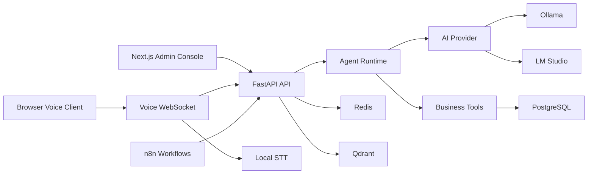

# AgVoiceX

**AgVoiceX is a self-hosted, local-first AI voice-agent platform for building multi-tenant business agents with FastAPI, Next.js, PostgreSQL, Ollama, LM Studio, n8n, and local speech services.**

[](https://github.com/tahsinmert/AgVoiceX/actions/workflows/ci.yml)
[](backend/pyproject.toml)
[](frontend/package.json)
[](backend/pyproject.toml)
[](LICENSE)

AgVoiceX gives teams a production-minded foundation for local AI agents: tenant-aware agent configuration, structured intent detection, reservations, customer records, knowledge search, runtime events, prompt management, plugin manifests, browser voice mode, and workflow automation. It is designed for organizations that need privacy, portability, and full infrastructure control before adding hosted services.

## Why AgVoiceX

- **Self-hosted AI agents**: run locally with Ollama or OpenAI-compatible LM Studio instead of requiring a hosted LLM API.
- **Multi-tenant platform model**: organizations, businesses, agents, prompts, provider settings, memory, and runtime events are scoped for SaaS-style operation.
- **Business-ready workflows**: reservation, customer, FAQ, knowledge, admin-report, and workflow routes are implemented with real persistence.
- **Modern admin console**: Next.js, TypeScript, Tailwind, and shadcn-style components for managing agents, prompts, reservations, knowledge, analytics, branding, workflows, and local models.
- **Local voice path**: browser microphone streaming, local speech-to-text, backend runtime orchestration, and local text-to-speech integration.
- **Automation boundary**: n8n workflows call the backend API instead of duplicating business rules.
- **Operational foundation**: Docker Compose, Alembic migrations, tests, linting, health checks, and GitHub community files are included.

## Current Capabilities

| Area | Status |
| --- | --- |
| FastAPI conversation API | Implemented |
| PostgreSQL domain persistence | Implemented |
| Multi-tenant organizations, businesses, agents | Implemented |
| Agent prompt/version management | Implemented |
| Ollama and LM Studio provider support | Implemented |
| Structured intent detection | Implemented |
| Restaurant reservation engine | Implemented |
| Customer, knowledge, settings, runtime event APIs | Implemented |
| Admin UI with operational pages | Implemented |
| Browser voice websocket path | Implemented |
| Local STT/TTS integration | Implemented, model-dependent |
| n8n workflow JSON definitions | Implemented |
| Qdrant/Redis services | Provisioned for extension |
| Telephony carrier integration | Not included |
| Hosted LLM dependency | Not required |

## Architecture



## Tech Stack

- **Backend**: FastAPI, SQLAlchemy, Alembic, Pydantic, httpx, Redis client, local AI provider adapters.
- **Frontend**: Next.js 16, React 18, TypeScript, Tailwind CSS, lucide-react, Radix primitives.
- **Data**: PostgreSQL as source of truth, Redis for realtime/session extension, Qdrant for vector-search extension.
- **AI runtime**: Ollama, LM Studio, local intent contracts, deterministic internal planner, tool executor.
- **Voice**: browser MediaRecorder websocket streaming, MLX Whisper STT, Coqui TTS.
- **Automation**: n8n workflow definitions using backend API endpoints.
- **DevOps**: Docker Compose, health checks, pytest, Ruff, Next.js build, GitHub Actions, Dependabot.

## Repository Layout

```text
.
├── backend/                 # FastAPI app, domain services, schemas, models, Alembic, tests
├── frontend/                # Next.js admin console
├── n8n/workflows/           # Importable workflow definitions
├── docs/                    # Architecture, runtime, multi-tenancy, hardening notes
├── database/                # Seed data
├── prompts/                 # Prompt contracts
├── scripts/                 # Operational helper scripts
├── docker-compose.yml       # Local production-like stack
└── README.md
```

## Quick Start

### 1. Clone and configure

```bash
git clone https://github.com/tahsinmert/AgVoiceX.git
cd AgVoiceX
cp .env.example .env
```

Review `.env` before starting the stack. At minimum, change `N8N_BASIC_AUTH_PASSWORD` before sharing the environment.

### 2. Start the platform

```bash
docker compose up -d
docker compose exec backend alembic upgrade head
```

### 3. Verify health

```bash
curl http://localhost:8000/health
bash scripts/dev-check.sh
```

### 4. Open the admin console

```text
http://localhost:3000
```

Useful local services:

| Service | URL |
| --- | --- |
| Admin UI | `http://localhost:3000` |
| Backend API | `http://localhost:8000` |
| n8n | `http://localhost:5678` |
| Qdrant | `http://localhost:6333` |
| Ollama | `http://localhost:11434` |

## Local AI Setup

AgVoiceX does not require a hosted model provider. Use a local provider and select a model in the admin console or through the settings API.

Pull an Ollama model:

```bash
docker compose exec ollama ollama pull llama3.1:8b
```

Set provider and model:

```bash
curl -X PUT http://localhost:8000/api/v1/settings/provider \
  -H 'Content-Type: application/json' \
  -d '{"provider":"ollama"}'

curl -X PUT http://localhost:8000/api/v1/settings/model \
  -H 'Content-Type: application/json' \
  -d '{"model":"llama3.1:8b"}'
```

Test chat:

```bash
curl -X POST http://localhost:8000/api/v1/chat \
  -H 'Content-Type: application/json' \
  -d '{"message":"Book a table for 2 on 2026-07-10 at 19:00. My name is Ada Lovelace and my phone is 555-0101."}'
```

## Restaurant Demo

Seed a realistic local restaurant configuration:

```bash
docker compose exec backend alembic upgrade head
docker compose exec backend python scripts/seed_restaurant_demo.py
```

Check availability:

```bash
curl -X POST http://localhost:8000/api/v1/reservations/availability \
  -H 'Content-Type: application/json' \
  -d '{"organization_id":1,"business_id":1,"reservation_date":"2026-07-06","reservation_time":"18:00","people":2}'
```

Create a reservation:

```bash
curl -X POST http://localhost:8000/api/v1/reservations \
  -H 'Content-Type: application/json' \
  -d '{"organization_id":1,"business_id":1,"customer_name":"Ada Lovelace","phone":"+90-555-0199","reservation_date":"2026-07-06","reservation_time":"18:00","people":2,"notes":"Window table if available"}'
```

## Multi-Tenant Agent Platform

Create organization and business records:

```bash
curl -X POST http://localhost:8000/api/v1/organizations \
  -H 'Content-Type: application/json' \
  -d '{"name":"Acme","slug":"acme"}'

curl -X POST http://localhost:8000/api/v1/businesses \
  -H 'Content-Type: application/json' \
  -d '{"organization_id":1,"name":"Acme Restaurant","slug":"restaurant"}'
```

Create an agent and prompt:

```bash
curl -X POST http://localhost:8000/api/v1/agents \
  -H 'Content-Type: application/json' \
  -d '{"organization_id":1,"business_id":1,"name":"Reservation Agent","provider":"ollama","model":"llama3.1:8b"}'

curl -X POST http://localhost:8000/api/v1/prompts \
  -H 'Content-Type: application/json' \
  -d '{"organization_id":1,"agent_id":1,"name":"Reservation Prompt","content":"You help manage restaurant reservations."}'
```

Stream with tenant and agent context:

```bash
curl -N -X POST http://localhost:8000/api/v1/chat/stream \
  -H 'Content-Type: application/json' \
  -d '{"organization_id":1,"business_id":1,"agent_id":1,"message":"Hello"}'
```

See [Multi-Tenancy](docs/multi-tenancy.md) and [Agent Runtime](docs/agent-runtime.md) for the internal model.

## Admin Console

The admin console includes:

- Dashboard health, reservations, customers, covers, conversations, and errors.
- Business templates for local white-label starter packs.
- Prompt Studio for prompt creation, versioning, and activation.
- RAG ingestion job tracking and knowledge chunk inspection.
- Reservation create, update, cancel, and filtering.
- Knowledge upload and search for TXT, Markdown, JSON, and CSV content.
- Agent list, create, and edit controls.
- Analytics dashboard for local operational metrics.
- Provider/model selection and model test.
- Playground with raw JSON, memory, and runtime events.
- Browser voice mode at `/voice`.
- Workflow builder for local workflow definitions.
- Branding metadata management.
- Plugin manifest list.

Run the frontend locally:

```bash
cd frontend
cp .env.example .env.local
npm install
npm run dev
```

Build check:

```bash
cd frontend
npm run build
```

## Voice Mode

The voice client is available at:

```text
http://localhost:3000/voice
```

Voice mode uses the browser microphone, sends audio chunks to the backend websocket, transcribes locally, runs the same agent runtime as text chat, and returns local TTS audio. It is not a telephony carrier integration.

Model-dependent environment variables:

```bash
STT_MODEL_PATH=mlx-community/whisper-base-mlx
TTS_MODEL_NAME=tts_models/multilingual/multi-dataset/xtts_v2
TTS_DEVICE=auto
TTS_LANGUAGE=tr
TTS_SPEAKER=
TTS_SPEAKER_WAV=
```

Some Coqui TTS models require either `TTS_SPEAKER` or `TTS_SPEAKER_WAV`.

## Knowledge and RAG

Upload knowledge:

```bash
curl -X POST http://localhost:8000/api/v1/knowledge/upload \
  -F "file=@knowledge/menu.md"
```

Ingest an allowed local path:

```bash
curl -X POST http://localhost:8000/api/v1/knowledge/ingest \
  -H 'Content-Type: application/json' \
  -d '{"organization_id":1,"path":"/workspace/knowledge/menu.md","source":"menu"}'
```

Search knowledge:

```bash
curl -X POST http://localhost:8000/api/v1/knowledge/search \
  -H 'Content-Type: application/json' \
  -d '{"query":"baklava","limit":5}'
```

## n8n Workflows

Workflow definitions live in `n8n/workflows/` and are designed to call backend endpoints. Import them into n8n after the stack is running:

```bash
bash scripts/import_n8n_workflows.sh
```

If port `5678` is unavailable, set `N8N_HOST_PORT` in `.env`.

## Development

Backend:

```bash
cd backend
python3.10 -m venv .venv
. .venv/bin/activate
pip install -e '.[dev]'
pytest -q
ruff check app tests
```

Install local voice dependencies when developing STT/TTS features:

```bash
pip install -e '.[voice,dev]'
```

Frontend:

```bash
cd frontend
npm install
npm run build
```

Full local check:

```bash
bash scripts/dev-check.sh
```

## Security and Production Notes

AgVoiceX is self-hosted infrastructure. Before exposing it beyond a local machine:

- Put the API and admin console behind TLS and authentication.
- Keep `.env` out of git and rotate any shared demo credentials.
- Restrict `BACKEND_CORS_ORIGINS`.
- Do not expose PostgreSQL, Redis, Qdrant, Ollama, or n8n directly on the public internet.
- Review [Production Hardening Notes](docs/production-hardening.md).
- Report vulnerabilities through [SECURITY.md](SECURITY.md).

## Roadmap

- First-party authentication and role-based access control.
- Deeper Qdrant vector retrieval integration.
- Hardened realtime voice session management.
- Workflow marketplace packaging.
- Tenant-level billing and usage reporting primitives.
- Production deployment templates.

## Contributing

Contributions are welcome. Please read [CONTRIBUTING.md](CONTRIBUTING.md), [CODE_OF_CONDUCT.md](CODE_OF_CONDUCT.md), and [SECURITY.md](SECURITY.md) before opening issues or pull requests.

## License

AgVoiceX is released under the [MIT License](LICENSE).
