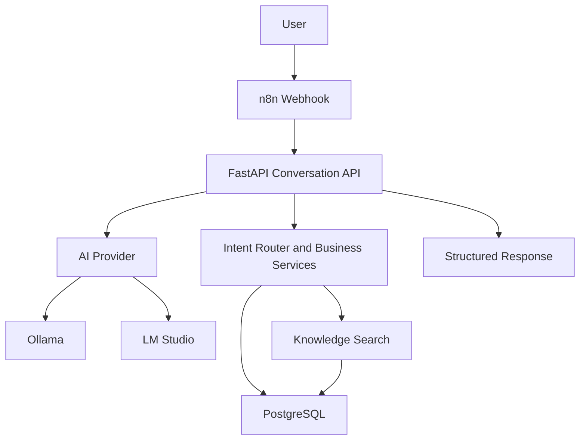

# Architecture

The first version is a text-only local AI agent platform.

## Boundaries

- n8n owns workflow orchestration and external webhook surfaces.
- FastAPI owns validation, intent execution, persistence, and local AI contracts.
- AI providers only perform generation or streaming. They do not mutate tenant state.
- PostgreSQL is the source of truth.
- Qdrant is reserved for vector search in the next knowledge-search milestone.
- Redis is reserved for realtime/session work.
- Organizations own all resources. Legacy calls use a default organization for backward compatibility.
- Agents, prompts, tools, and plugins are isolated behind services and registries.

## Later Milestones

- Whisper.cpp for local speech-to-text.
- Piper for local text-to-speech.
- LiveKit and Pipecat for realtime voice sessions.
- Next.js admin console.
